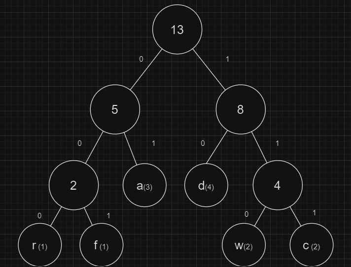
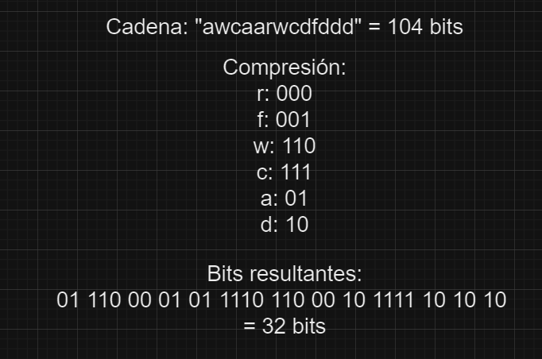
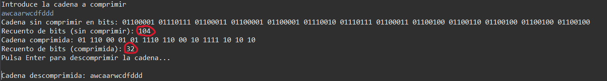

 

    
  
## Algoritmo de Compresión Huffman

 

Este proyecto implementa un algoritmo de compresión de texto basado en el árbol de Huffman. El objetivo es comprimir una cadena de texto ingresada por el usuario y luego descomprimirla para verificar su correcto funcionamiento.

 

## ¿Qué es el algoritmo de Huffman?

 

El **algoritmo de Huffman** es un método de compresión sin pérdida que asigna códigos de longitud variable a los caracteres de una cadena, basándose en la frecuencia de aparición de cada carácter. Los caracteres que aparecen con mayor frecuencia reciben códigos más cortos, lo que reduce el tamaño total de la cadena cuando se representa en bits.

 

### Ejemplo de construcción del Árbol de Huffman

 
 
  
  

A partir de la cadena de ejemplo "awcaarwcdfddd", se ha generado el árbol de Huffman, que asocia a cada carácter un código binario específico.

### Resultado de la compresión

 
 
  
 

El resultado anterior muestra cómo los caracteres de la cadena se han reducido a una secuencia de bits más compacta, con los códigos generados por el algoritmo.

### Ejecución en consola

El programa permite ingresar una cadena, comprimirla utilizando el árbol de Huffman y descomprimirla para validar que el resultado final es el correcto.

 

  
 
## ¿Cómo funciona el programa?

El programa está dividido en dos clases principales, cada una encargada de diferentes aspectos del algoritmo de Huffman:    

   **`Algoritmo.java`**  
   Esta clase implementa el flujo principal del algoritmo de compresión y descompresión. Los pasos clave son:    
   - **Extraer bytes**: Convierte la cadena de texto ingresada a su representación en bytes y los muestra en bits.    
   - **Construir árbol de Huffman**: Crea el árbol de Huffman basado en las frecuencias de los caracteres presentes en la cadena.    
   - **Comprimir la cadena**: Utiliza el árbol de Huffman para generar una representación comprimida de la cadena.    
   - **Descomprimir la cadena**: A partir de la cadena comprimida y el árbol de Huffman, reconstruye la cadena original para verificar que el proceso de compresión y descompresión funciona correctamente.    
   
   
  
   **`Nodo.java`**  
   Esta clase define la estructura de los nodos del árbol de Huffman. Cada nodo puede ser:    
   - **Hoja**: Contiene un carácter y su frecuencia de aparición.    
   - **Nodo interno**: Representa la combinación de dos nodos (o subárboles) y contiene la suma de sus frecuencias.    
